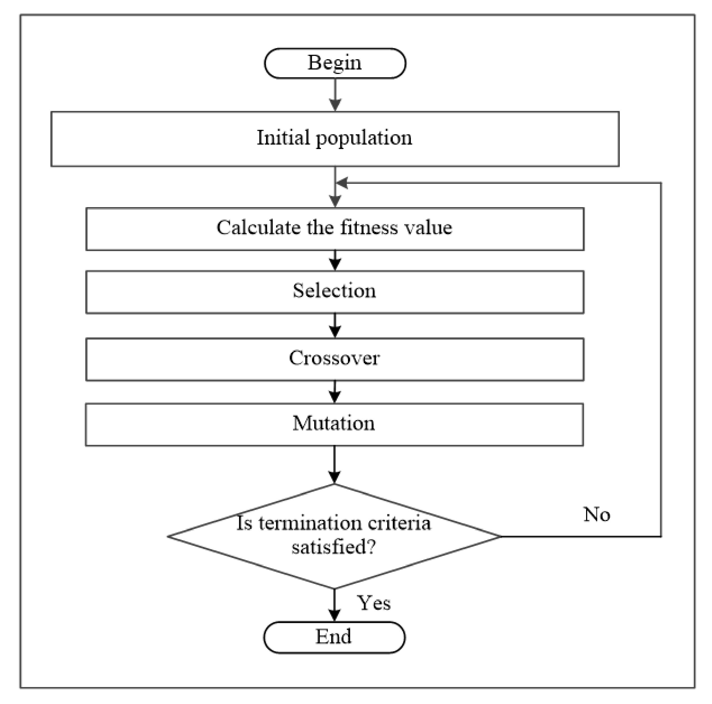
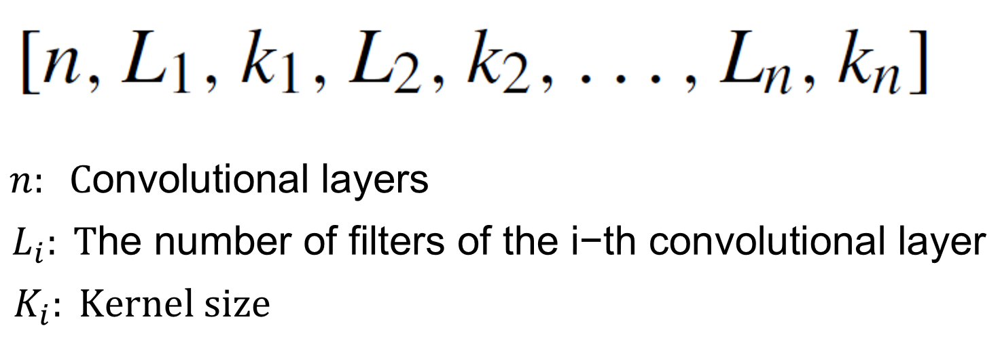
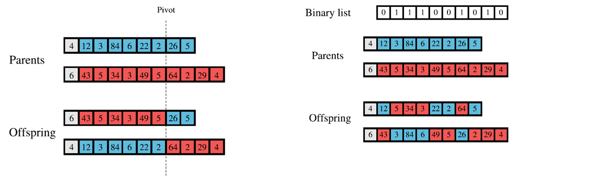
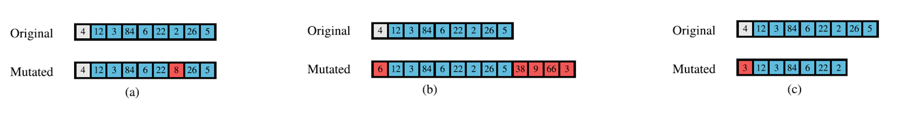

# CNN Optimization using Genetic Algorithm
This repository contains an implementation of a Genetic model that tries to optimize the structure of a Convolution Neural Network (CNN).  

### Requirements
only `tensorflow` in needed. See [requirements.txt](requirements.txt) and use `pip install -r requirements.txt` for installation.
  

## About Genetic-algorithm
In computer science and operations research, a genetic algorithm (GA) is a metaheuristic inspired by the process of natural selection that belongs to the larger class of evolutionary algorithms (EA). Genetic algorithms are commonly used to generate high-quality solutions to optimization and search problems by relying on biologically inspired operators such as mutation, crossover and selection. Some examples of GA applications include optimizing decision trees for better performance, solving sudoku puzzles, hyperparameter optimization, causal inference, etc. [[Wiki](https://en.wikipedia.org/wiki/Genetic_algorithm)].

  

## Project structure
- ### 📂 directory [genetic_cnn_optimizer]
    - #### 📄 file [cnn_chromo.py]
      This file contains `CNNChromo` class. This is the representation of a CNN in genetic. Each chromosome consist of an array:
        

          
        

      I have implemented two Crossover operations, the first one is a pivot based crossover and the other uses a random binary list for dividing genomes.
      

          
      

      The mutation operation will change one genome randomly. There are three conditions that may happen in mutation. (a) change one genome $L_{i}$ or ............... $K_{i}$ (b) increase number of layers (c) decrease number of layers 
      

          
      

    - #### 📄 file [genetic_cnn.py]
      This file contains `GeneticCNN_finder` class. This is where Genetic Algorithm is implemented. The constructor of this class takes a parameter `accuracy_function` that should be a function for evaluating the accuracy of every CNN created by the genetic. 

- ### 📄 file [main.ipynb]
  These file is my Demo file that show how to make in-use this classifier on `cifar10` dataset (provided by `keras.datasets`).